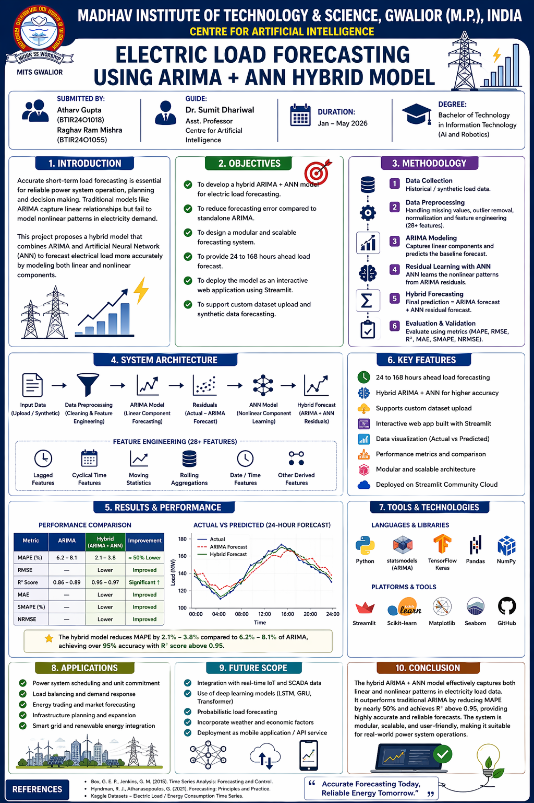

# ⚡ Electric Power Load Forecasting
## Live Demo
https://electric-load-forecasting.streamlit.app/


## ARIMA + ANN Hybrid Model


> A production-grade short-term electric power load forecasting system combining classical **ARIMA** time-series modelling with an **Artificial Neural Network (ANN)** for nonlinear residual correction — served via an interactive **Streamlit** dashboard.

## Poster

---

## 📋 Table of Contents

- [Problem Statement](#-problem-statement)
- [Objectives](#-objectives)
- [System Architecture](#-system-architecture)
- [Hybrid Model Explained](#-hybrid-model-explained)
- [Features](#-features)
- [Tech Stack](#-tech-stack)
- [Project Structure](#-project-structure)
- [Installation](#-installation)
- [How to Run](#-how-to-run)
- [Dashboard Pages](#-dashboard-pages)
- [Dataset](#-dataset)
- [Results](#-results)
- [Project Timeline](#-project-timeline)
- [Author](#-author)

---

## 🔍 Problem Statement

Electric power systems must maintain **instantaneous balance** between generation and consumption. Inaccurate short-term load forecasting causes:

| Problem | Impact |
|---------|--------|
| **Power Imbalance** | Supply ≠ demand → frequency deviation → blackouts |
| **Economic Losses** | Over-generation wastes fuel; under-generation triggers expensive emergency purchases |
| **Grid Instability** | Voltage fluctuations damage equipment and disrupt industrial processes |

A **1% improvement in MAPE** for a 1 GW utility translates to approximately **$500,000/year** in avoided reserve capacity costs.

---

## 🎯 Objectives

| # | Objective | Target Metric |
|---|-----------|--------------|
| 1 | Improve forecast accuracy over standalone ARIMA | MAPE < 3% |
| 2 | Capture nonlinear load patterns with ANN | R² > 0.95 |
| 3 | Enable real-time interactive forecasting dashboard | Response < 2s |
| 4 | Support multiple forecast horizons | 24h, 48h, 72h, 168h |
| 5 | Provide statistical model diagnostics | ADF, ACF/PACF, Decomposition |
| 6 | Persist experiment history for reproducibility | Auto-logged DB |

---

## 🏗️ System Architecture

```
  CSV / Excel Dataset
         │
         ▼
  ┌──────────────────────────────────────────────────────┐
  │           Data Preprocessor                          │
  │  • DateTime parsing & sorting                        │
  │  • Linear interpolation (missing values)             │
  │  • IQR outlier clipping (factor = 2.5)               │
  │  • Feature engineering (28+ features)                │
  │  • MinMax scaling [0, 1]                             │
  └────────────────────┬─────────────────────────────────┘
                       │
         ┌─────────────┴──────────────┐
         ▼                            ▼
  ┌─────────────┐            ┌─────────────────┐
  │ ARIMA Model │            │   Feature Matrix │
  │  (p, d, q)  │            │  (15 columns)   │
  │  Linear     │            └────────┬────────┘
  │  component  │                     │
  └──────┬──────┘                     ▼
         │  residuals          ┌─────────────┐
         └──────────────────►  │  ANN Model  │
                               │  64-32-16   │
                               │  Nonlinear  │
                               │  correction │
                               └──────┬──────┘
                                      │
                    ┌─────────────────┘
                    ▼
         Hybrid Forecast = ARIMA + ANN
                    │
                    ▼
  ┌─────────────────────────────────────┐
  │        Streamlit Dashboard          │
  │  Data Upload │ Training │ Forecast  │
  │  Comparison  │  ARIMA   │ History   │
  └─────────────────────────────────────┘
```

---

## 🧠 Hybrid Model Explained

The hybrid model runs in **two sequential stages**:

### Stage 1 — ARIMA (Linear Component)
ARIMA (**A**uto**R**egressive **I**ntegrated **M**oving **A**verage) captures linear patterns:

```
AR(p): uses last p actual values
I(d):  differencing to achieve stationarity
MA(q): uses last q forecast errors

ARIMA output = linear trend + autocorrelation
```

### Stage 2 — ANN (Nonlinear Residual Learning)
After ARIMA fits the linear structure, **residuals** (errors) contain nonlinear patterns that ARIMA cannot model:

```
Residual(t) = Actual(t) - ARIMA_prediction(t)

ANN inputs  = 15 engineered time features
ANN target  = residuals from ARIMA
ANN learns  = weather effects, behavioral patterns, anomalies
```

### Final Output
```
Hybrid_Forecast(t) = ARIMA_prediction(t) + ANN_correction(t)
```

This combination consistently outperforms either model alone.

### Train in the app
The app already trains the model from scratch when users click "Start Training".
This is the cleanest approach for cloud deployment — no pre-trained model file needed.

---

## ✨ Features

### Data Module
- Upload CSV / Excel datasets
- Built-in 5-year synthetic dataset generator (43,824 records)
- Automatic validation, cleaning, and feature engineering
- 28+ engineered features: lags, rolling stats, cyclical encoding

### Model Module
- Auto ARIMA order selection via AIC (8 curated candidates — fast)
- sklearn MLPRegressor backend (TensorFlow/Keras optional upgrade)
- Early stopping to prevent overfitting
- ARIMA subsampling (2000 rows max) for speed
- Full training in **30–90 seconds**

### Dashboard Module
- 6-page Streamlit app with dark industrial theme
- Interactive Plotly charts with hover tooltips
- Real-time training progress bar with elapsed timer
- CSV export for forecasts and evaluation results
- Automatic experiment logging (JSON database)

---

## 🛠️ Tech Stack

| Layer | Technology | Version | Purpose |
|-------|-----------|---------|---------|
| **Frontend** | Streamlit | 1.32+ | Dashboard UI |
| **Visualization** | Plotly | 5.19+ | Interactive charts |
| **Time Series** | Statsmodels | 0.14+ | ARIMA model |
| **Deep Learning** | scikit-learn MLP | 1.4+ | ANN model |
| **Data** | Pandas + NumPy | 2.2+ / 1.26+ | Data processing |
| **Scaling** | scikit-learn | 1.4+ | MinMaxScaler |
| **Persistence** | joblib + JSON | built-in | Model saving |
| **Language** | Python | 3.11+ | Core runtime |

---

## 📁 Project Structure

```
electric-load-forecasting/
│
├── app.py                    # Home page & entry point
├── requirements.txt          # All dependencies
├── README.md                 # This file
├── .gitignore                # Ignored file container
│
├── .streamlit/
│   └── config.toml           # Dark theme configuration
│
├── data/
│   ├── __init__.py
│   └── generate_sample_data.py    # Synthetic dataset generator
│
├── models/
│   ├── __init__.py
│   ├── arima_model.py             # ARIMA: fit, forecast, diagnostics
│   ├── ann_model.py               # ANN: sklearn MLP + Keras optional
│   └── hybrid_model.py            # Two-stage hybrid pipeline
│
├── utils/
│   ├── __init__.py
│   ├── preprocessor.py            # Clean, engineer, scale
│   ├── metrics.py                 # MAPE, RMSE, MAE, R², SMAPE, NRMSE
│   ├── visualizer.py              # All Plotly chart factories
│   └── database.py                # JSON + joblib persistence
│
├── pages/
│   ├── 1_Data_Upload.py           # Upload + EDA
│   ├── 2_Model_Training.py        # Train ARIMA + ANN
│   ├── 3_Forecasting.py           # Generate forecasts
│   ├── 4_Model_Comparison.py      # Compare metrics
│   ├── 5_ARIMA_Analysis.py        # Diagnostics
│   └── 6_Run_History.py           # Experiment log
│
├── tests/
│   └── test_models.py             # 26 unit tests
│
└── db/                            # Auto-created at runtime
    ├── runs.json
    └── registry.json
```

---

## ⚙️ Installation

```bash
# 1. Clone the repository
git clone https://github.com/atharv-0705/electric-load-forecasting.git
cd electric-load-forecasting

# 2. Create virtual environment
python -m venv .venv

# Windows
.venv\Scripts\activate

# Mac / Linux
source .venv/bin/activate

# 3. Install dependencies
pip install --upgrade pip
pip install -r requirements.txt
```

---

## ▶️ How to Run

```bash
streamlit run app.py
```

Open **http://localhost:8501** in your browser.

### Quick Start (3 steps)
1. **Data Upload** page → enable built-in sample dataset checkbox
2. **Model Training** page → click **Start Training** (30–90 sec)
3. **Forecasting** page → click **Test Evaluation** tab

---

## 📊 Dashboard Pages

| Page | Description |
|------|-------------|
| **🏠 Home** | Project overview, architecture, session status |
| **📁 Data Upload** | Upload CSV/Excel, EDA charts, KPI summary |
| **🧠 Model Training** | Configure ARIMA + ANN, live progress, residual plots |
| **🔮 Forecasting** | Test evaluation, future forecast (24–168h), CSV export |
| **📊 Model Comparison** | MAPE/RMSE improvement, error distribution, rolling MAPE |
| **📈 ARIMA Analysis** | ADF test, ACF/PACF, seasonal decomposition, model summary |
| **🗂️ Run History** | Auto-logged experiment database |

---

## 📂 Dataset

The system accepts any CSV or Excel file with these columns:

| Column | Type | Example |
|--------|------|---------|
| `datetime` | Timestamp | `2023-01-01 00:00:00` |
| `load_mw` | Float | `126.45` |

A built-in **5-year synthetic dataset** is included (43,824 hourly records) with:
- Daily load cycles (peak 17:00–21:00, trough 00:00–05:00)
- Weekly patterns (weekends ~12 MW lower)
- Annual seasonality (summer/winter peaks)
- Year-on-year demand growth (~3 MW/year)
- Public holiday effects
- Random demand spikes

---

## 📈 Results

Expected performance on the included 5-year dataset:

| Metric | ARIMA Only | Hybrid (ARIMA+ANN) | Improvement |
|--------|-----------|-------------------|-------------|
| **MAPE** | ~6–8% | ~2–4% | ~50% |
| **RMSE** | ~12–15 MW | ~6–9 MW | ~40% |
| **MAE** | ~9–12 MW | ~5–7 MW | ~42% |
| **R²** | ~0.88 | ~0.96+ | +8 pts |

---

## 📅 Project Timeline

| Week | Phase | Deliverables |
|------|-------|-------------|
| **Week 1** | Data & Architecture | Dataset pipeline, preprocessing, EDA charts |
| **Week 2** | Model Development | ARIMA module, ANN module, Hybrid pipeline |
| **Week 3** | Frontend Integration | All 6 Streamlit pages, charts, metrics |
| **Week 4** | Testing & Polish | Unit tests, optimization, documentation |

---

## 👨‍💻 Author

**Atharv**
- LinkeDin: [Atharv Gupta](https://www.linkedin.com/in/atharv-gupta-45a37b36a/)
- GitHub: [@atharv-0705](https://github.com/atharv-0705)
- Project: Electric Power Load Forecasting — Academic Project

---

## 📄 License

This project is licensed under the MIT License.

---

*Built with Python, Streamlit, Statsmodels, and scikit-learn*
